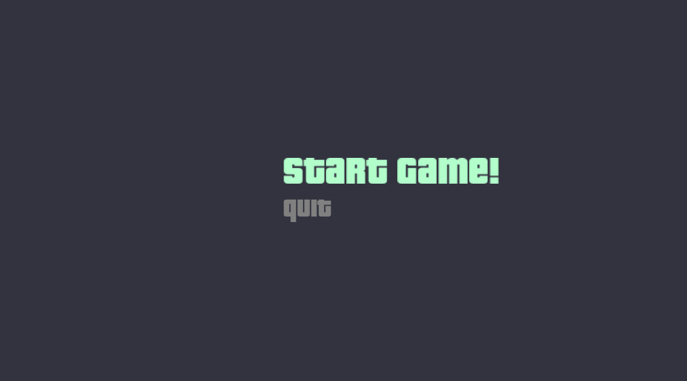
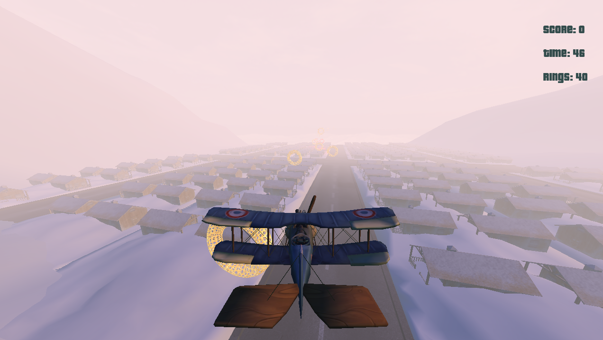
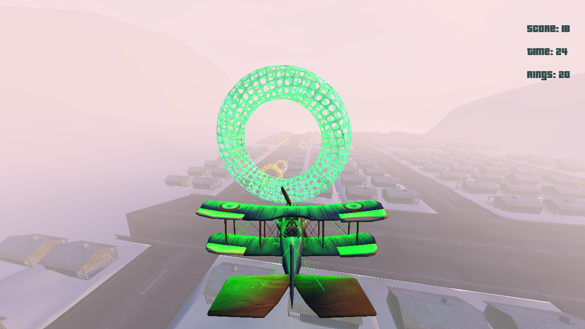
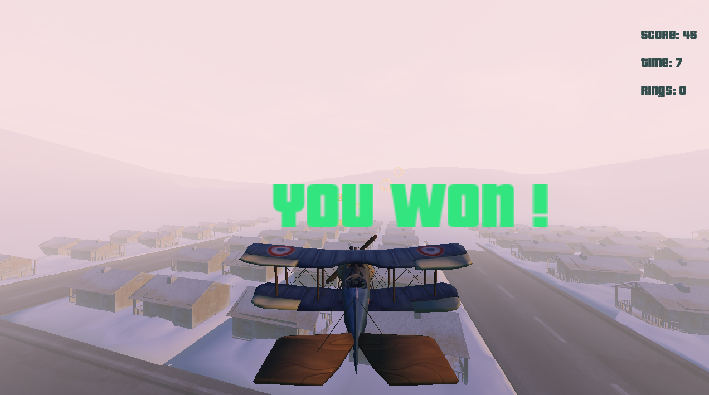
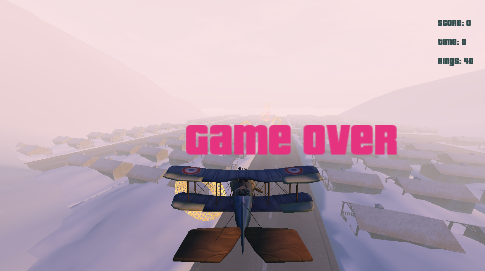
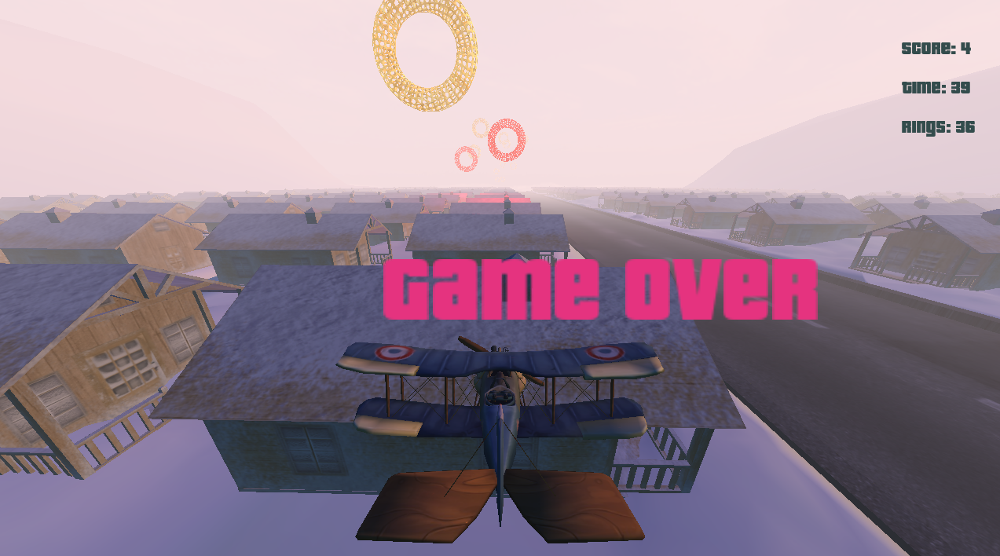

## Plane Game

* plane game is 3d game implemented using c++ it uses openGL for rendering
* it has 3d rendering system, collision detection system , text rendering system , lighting system and more ...

### Screen Shoots

* Menu

* Loading

* Game 

* Lighting

* Text Rendering

* Collision Detection

