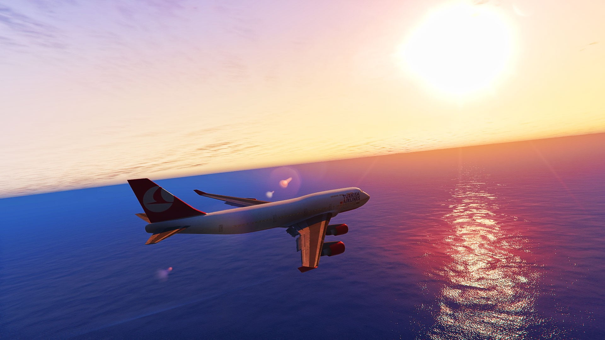
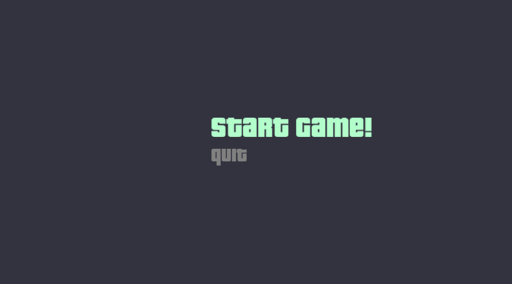
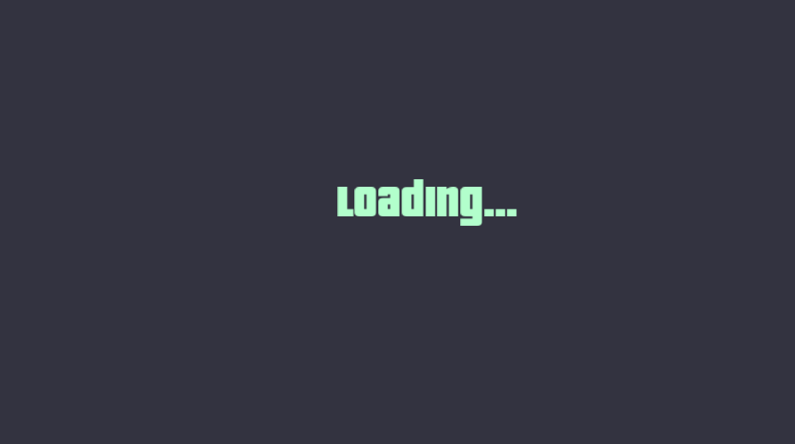
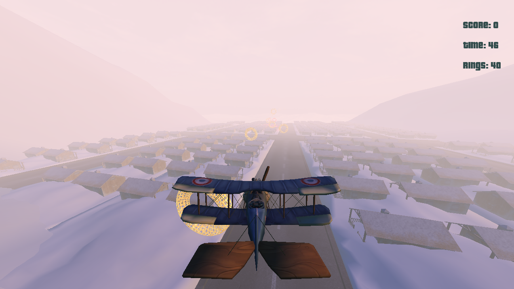
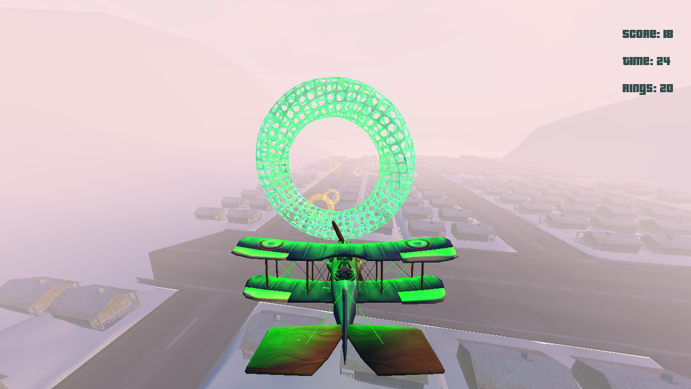
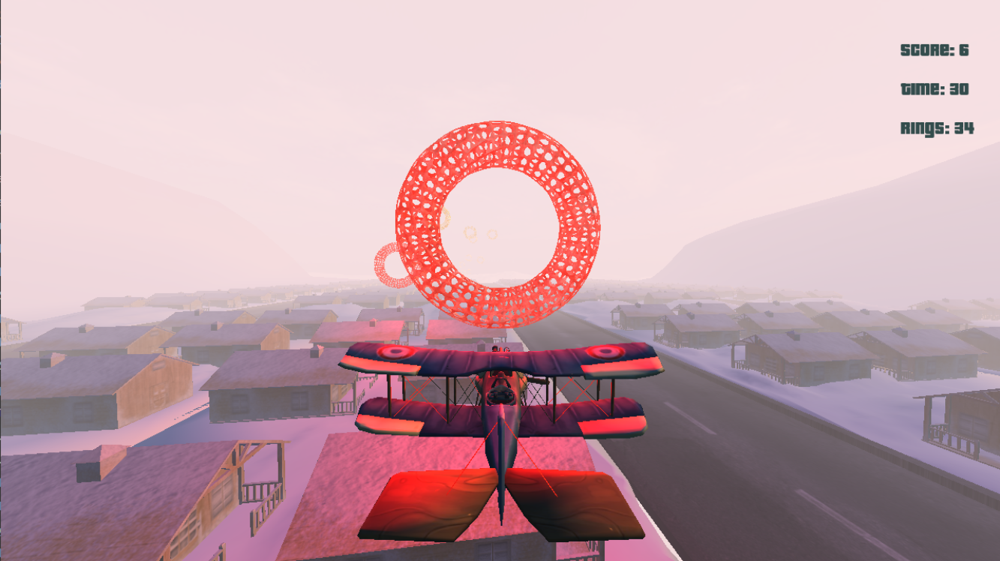
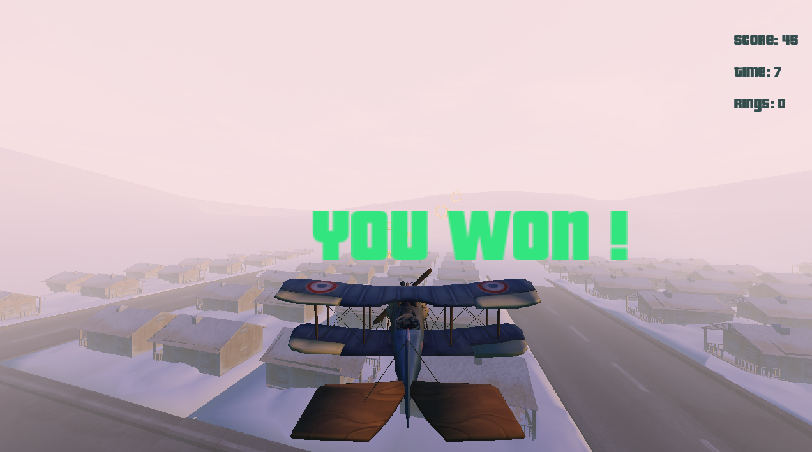
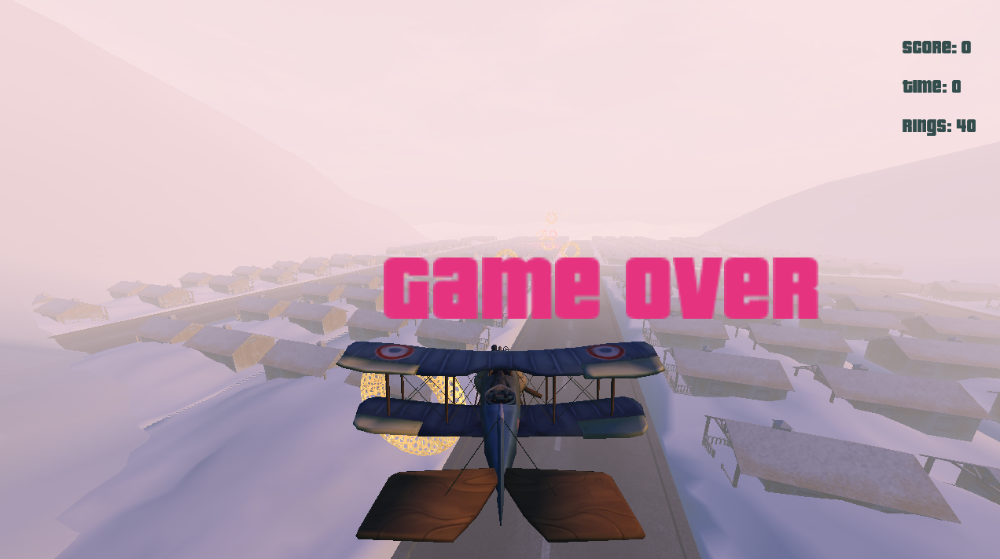
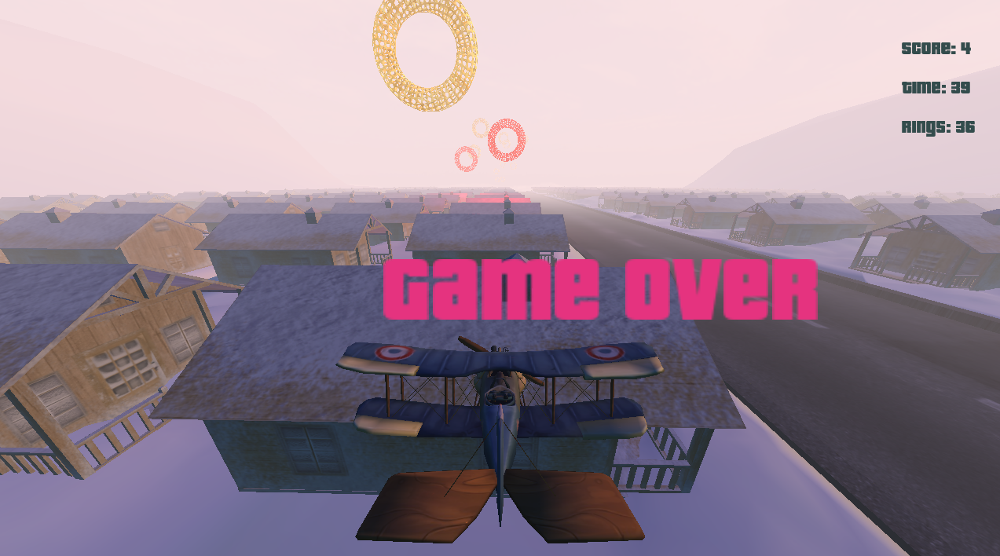

# Race The Planes Game 🚁




## 📝 Table of Contents

* [About](#about)
* [Getting Started](#start)
* [How to play](#play)
* [Built Using](#build)
* [Demo and Screenshots](#demo)

### 📙About<a name = "about"></a>

🚩 Race The Planes is a 3d game in which you try to collect as coins as you can to win before the time is up . you also try 
    to collect green coins to get more score and avoid red coins to not lose score .
* it`s mainly coded in c++ and uses openGL for rendering
* it has 3d rendering system, collision detection system , text rendering system , lighting system and more ...

## 🏁Getting Started <a name = "start"></a>

```
Install Visual Studio Code.
```

```
Open the folder in Visual Studio Code.
```

```
Build the project.
```

```
Open a terminal (Terminal > New Terminal).
```

```
Run this Command  .\bin\GAME_APPLICATION.exe -c="config\game.jsonc"
```

## 🎮How to play<a name = "play"></a>


* Press **W or S** to to move forward and backward.
* Use **A** to move left.
* Use **D** to move right.
* Use **space** to move plane up.
* Use **left ctrl** to move plane down.
* Use **Q , E** to rotate plane around its axis.

## 💻Built Using<a name = "build"></a>

* OpenGL

## 🎥 Demo<a name = "demo"></a>

<div name = "demo" align="center" width=1189>
  

  
</div>

### Screen Shoots

* Menu

* Loading

* Game

* Lighting



* Text Rendering


* Collision Detection

